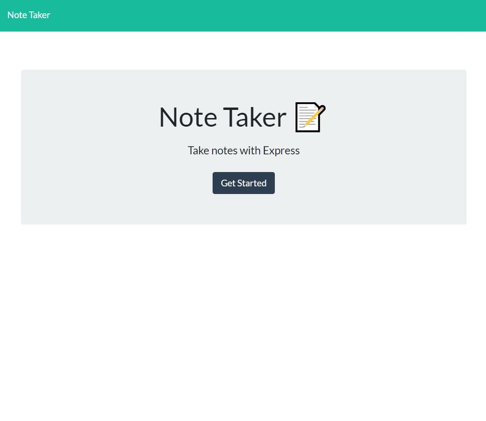
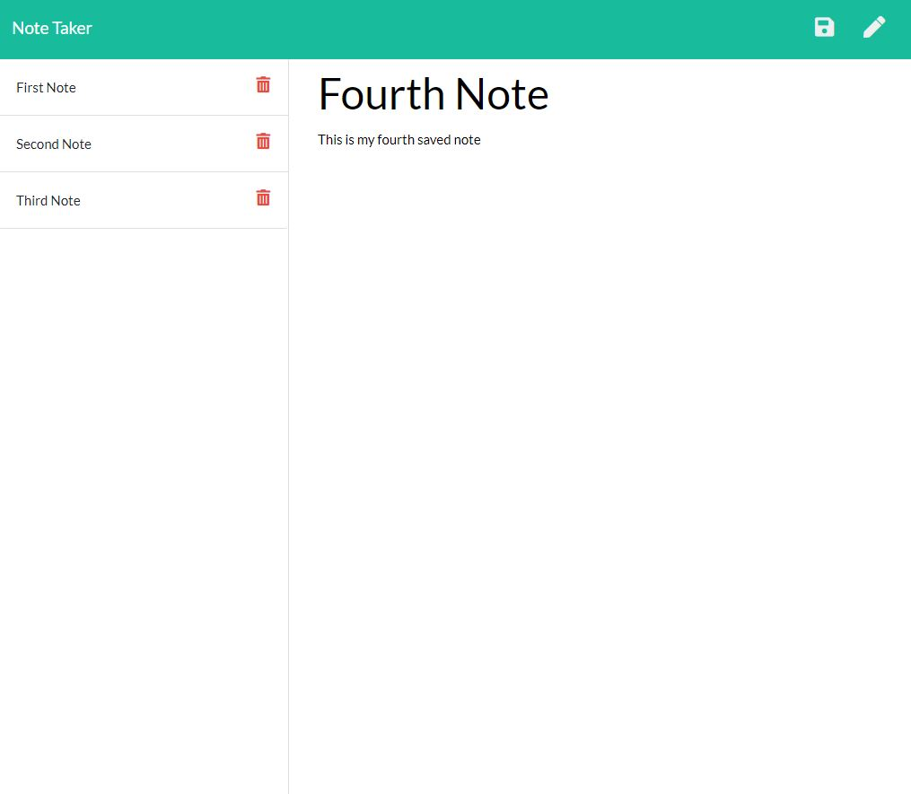

# Note-Taker

## Description

This application allows the user to write, save, and delete notes.  The application uses an express backend to save and retrieve notes from a JSON file.  The frontend of this project was given to the developer.  Routes needed to be created to allow the application to commuicate between the frontend and the backend.  The application will be deployed through Heroku.

## Developer 
 
 

Link to Deployment: [Note Taker](https://stormy-coast-65743.herokuapp.com/notes)

## Fucntionality

## Bugs and Issues
Found a bug? Review any [open issues][open-issues] or create a [new issues here][new-issue] so we can fix it for you!

## License
This application does not hold any licenses.

[open-issues]: https://github.com/dbridgman1/Note-Taker/issues
[new-issue]: https://github.com/dbridgman1/Note-Taker/issues/new